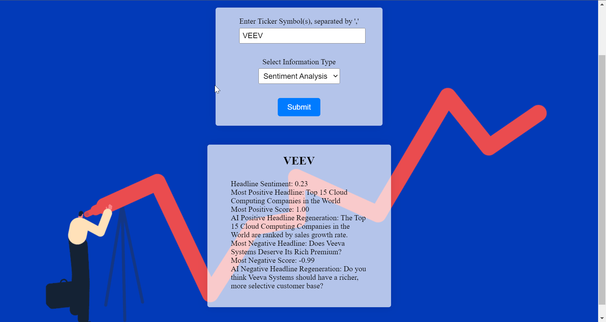

# stock-check, a Stock Analysis Dashboard by Alexander Nichols

## Tools used in the creation of this project:

> [Financial Modeling Prep API](https://site.financialmodelingprep.com/developer/docs/) 
 
> PyTorch, BeautifulSoup4, yfinance, FLASK

## Summary:

This is my stock dashboard, where with the input of stock ticker(s) of interest, a user will get access to a full wealth of formatted and calculated data of which to make decisions about the stock(s). 

A user will also get access to sentiment analysis of recent (<3 Days Old) news about their stock of choice, which can be used to make more decisions about their respective stocks

Using the _Financial Modeling Prep API_ and _yfinance_, I gather stock data from their balance sheets, income statements, company ratios, and Yahoo! Finance stock history to compile relevant information (current list of available data: Two-week history, EBIT, EBITDA, Current ratio, Earnings per Share, Return on Assets, Return on Equity, Debt-to-Equity Ratio, Operating Cash Flow, Dividend Yield).

Then, using _BeautifulSoup4_, I scrape Yahoo! Finance news about respective stocks, and using a pretrained sentiment analysis neural network called _distilbert_, assign those news headlines a positive or negative label as well as a score, and calculate relevant information. I also use a pretrained model called _Pegasus_ to regenerate the extreme-end headlines for possible further clarity (current list of available information: Headline Sentiment, Most Positive Headline, Most Positive Score, AI Positive Headline Regeneration, Most Negative Headline, Most Negative Score, AI Negative Headline Regeneration).

The licence can be found in [LICENSE](LICENSE.md). This can only be hosted locally through running [app_run](app_run.py). To run this locally on your machine, you'll need to provide a FLASK secret key to the [config](config.py), as well as an API key generated by signing up for _Financial Modeling Prep API_ (linked above) in [utils](utils.py). Mine are currently environmental variables. 

All provided files are necessary to run this.

Future work includes providing more data, as well as the website improvements. Any questions or suggestions should be emailed to _alexander.k.nichols@gmail.com_.

Sample Images for Veeva Systems (VEEV) Data and Sentiment (_29/04/23_)

